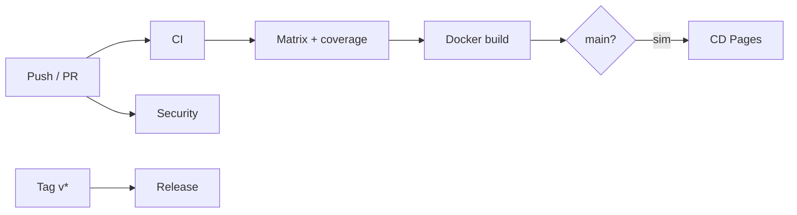

# ActionsLab

[](https://github.com/GuilhermeRoesler/ActionsLab/actions/workflows/ci.yml)
[](https://github.com/GuilhermeRoesler/ActionsLab/actions/workflows/security.yml)
[](https://guilhermeroesler.github.io/ActionsLab/)
[](https://www.python.org/)
[](LICENSE)

Laboratório prático (e de portfólio) para aprender **CI/CD com GitHub Actions**.

A calculadora Python é só o pretexto. O produto deste repositório é o **pipeline**: lint, testes em matrix, coverage gate, artifacts, build Docker, security scanning, Dependabot, deploy no GitHub Pages e releases por tag — com documentação e exercícios em português.

## O que você pratica aqui

| Prática | Implementação |
|---------|----------------|
| CI em toda push/PR | `.github/workflows/ci.yml` |
| Matrix (Python 3.11/3.12 + Windows) | `reusable-test.yml` |
| Reusable workflow | `workflow_call` |
| Coverage ≥ 80% + artifacts | pytest-cov + `upload-artifact` |
| Build de imagem sem push | job `docker` |
| CD após CI verde | `cd.yml` + `workflow_run` |
| Environment `production` | GitHub Pages |
| Security | `pip-audit` + CodeQL + Dependabot |
| Release | tags `v*` → `release.yml` |
| Exercícios guiados | [`docs/exercicios/`](docs/exercicios/) |

Diagrama e mapa completo: [`docs/conceitos.md`](docs/conceitos.md).



## Estrutura

```
.github/workflows/     # CI, CD, security, release, reusable
.github/dependabot.yml
docs/                  # conceitos, glossário, exercícios, branch protection
site/                  # artefato publicado no Pages (CD)
tests/                 # pytest parametrizado
calculadora.py         # app de demonstração
Dockerfile             # build validado no CI
pyproject.toml         # tooling (ruff, coverage, pytest)
```

## Rodando localmente

Pré-requisitos: Python 3.11+.

```bash
python -m venv .venv
# Windows: .venv\Scripts\activate
# Unix:    source .venv/bin/activate
pip install -r requirements.txt
ruff check .
pytest --verbose --cov=calculadora --cov-report=term-missing --cov-fail-under=80
```

(Opcional) build da imagem:

```bash
docker build -t actionslab:local .
```

## Pipelines no GitHub

1. Push ou PR → workflow **CI** (e **Security**).
2. CI verde na `main` → workflow **CD** publica `site/` no **GitHub Pages**.
3. Tag `v1.2.3` → workflow **Release** cria a GitHub Release.

### Habilitar Pages (uma vez)

1. **Settings → Pages** → Source: **GitHub Actions**
2. (Recomendado) **Settings → Environments** → criar `production`
3. Push na `main` e confira a URL em Settings → Pages

### Branch protection

Checklist em [`docs/branch-protection.md`](docs/branch-protection.md).

## Documentação

- [Mapa de conceitos](docs/conceitos.md)
- [Glossário](docs/glossario.md)
- [Exercícios](docs/exercicios/)
- [Self-hosted (opcional — não use em repo público)](docs/self-hosted-opcional.md)
- [Como contribuir](CONTRIBUTING.md)

## Segurança

- Não há runner **self-hosted** nos workflows ativos (risco em repositórios públicos).
- Dependabot atualiza `pip` e `github-actions` semanalmente.
- `security.yml` roda `pip-audit` e CodeQL (também via cron semanal).

## Licença

[MIT](LICENSE) © Guilherme Roesler
