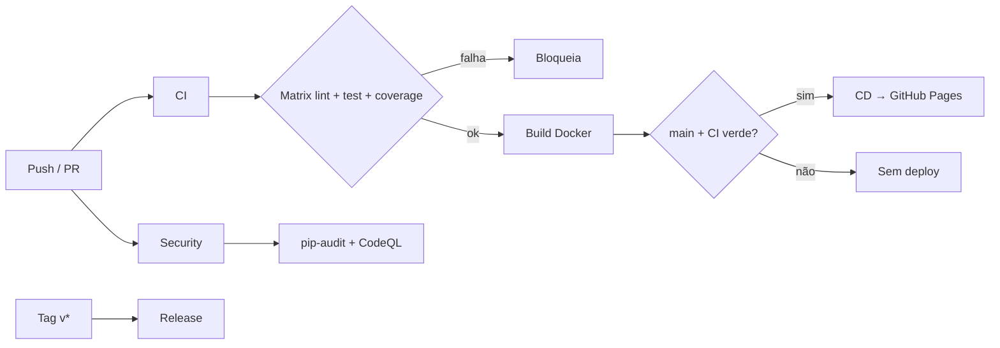

# Mapa de conceitos

Cada peça do laboratório mapeia para uma prática real de CI/CD.

| Conceito | Onde está | O que treina |
|----------|-----------|--------------|
| Integração Contínua | `.github/workflows/ci.yml` | Validar cada push/PR automaticamente |
| Matrix builds | `reusable-test.yml` | Mesmos checks em várias versões/OS |
| Reusable workflow | `reusable-test.yml` | DRY entre pipelines |
| Path filters | `ci.yml` / `cd.yml` | Evitar runs desnecessários |
| Concurrency | `ci.yml` | Cancelar runs obsoletos da mesma branch |
| Artifacts | upload de `junit.xml` / `htmlcov/` | Persistir evidências do job |
| Coverage gate | `--cov-fail-under=80` | Qualidade mínima como critério de merge |
| Build de container | job `docker` no CI | Validar `Dockerfile` sem publicar |
| Entrega Contínua | `.github/workflows/cd.yml` | Deploy automático após gate |
| Environments | `github-pages` no CD | Rastrear URL e proteger deploy |
| `workflow_run` | CD escuta CI | Separar CI de CD com dependência |
| `workflow_dispatch` | CI / CD / Security / Release | Disparo manual |
| Security scanning | `security.yml` | `pip-audit` + CodeQL |
| Dependabot | `.github/dependabot.yml` | Atualizar deps e Actions |
| Release por tag | `release.yml` | Versionamento + notas automáticas |
| Branch protection | `docs/branch-protection.md` | Required checks antes do merge |
| Self-hosted (opcional) | `docs/self-hosted-opcional.md` | Runner na sua máquina (risco em público) |

## Diagrama do fluxo principal

